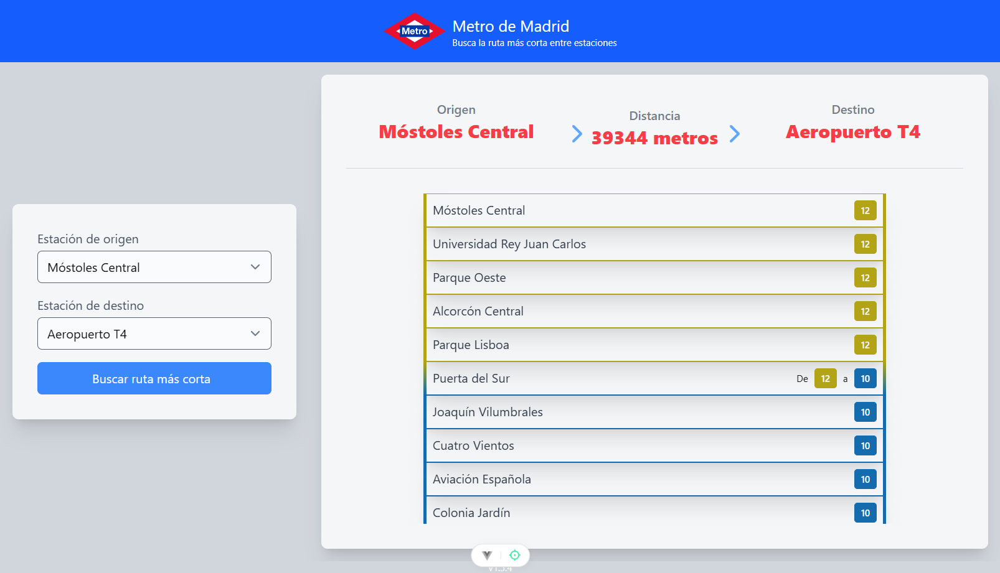

# tsMetro

[](https://app.netlify.com/sites/ts-metro/deploys)

<p align="center">
  
  <p align="center">Web app that minimizes distance between Metro de Madrid stations</p>
</p>

## Demo

https://ts-metro.netlify.app

### Desktop view

<p align="center">
  
</p>

### Mobile view

<p align="center">
  
</p>

## Project setup
```
npm install
```

### Compiles and hot-reloads for development
```
npm run dev
```

### Compiles and minifies for production
```
npm run build
```

### Run your unit tests
```
npm run test:unit
```

### Lints and fixes files
```
npm run lint
```

### Format files
```
npm run format
```

## Build with

* [Vue.js](https://vuejs.org)
* [Tailwind CSS](https://tailwindcss.com)

## References

* R. W. Floyd, "Algorithm 97: Shortest Path," Communications of the ACM, Vol. 5, No. 6, 1962, p. 345.
http://dx.doi.org/10.1145/367766.368168

## Credits

* Inspired by [JMetro](https://github.com/jiep/jMetro)
